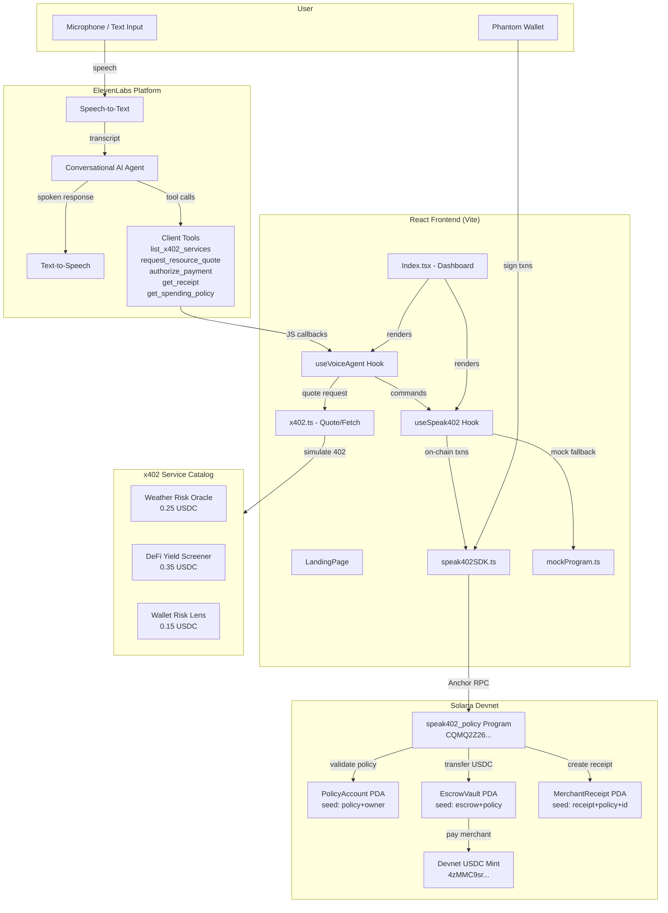
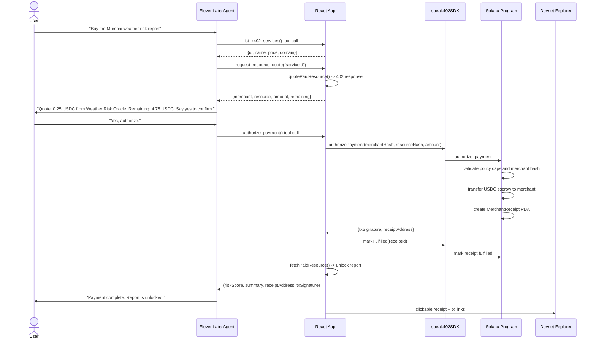

# Speak402 - Voice-Controlled x402 Payments on Solana

> **Give voice agents a wallet they cannot overspend.**

[](https://explorer.solana.com/?cluster=devnet)
[](https://elevenlabs.io)
[](https://x402.org)
[](LICENSE)
[](https://www.anchor-lang.com/)

Speak402 is a multilingual ElevenLabs voice agent that lets users purchase **x402-protected API resources** on Solana, governed by a **wallet-owned Rust/Anchor spending policy** that no backend can override. Users set per-request caps, daily caps, merchant restrictions, and expiry. The voice agent quotes, confirms, pays, and unlocks paid resources. Every purchase ends with an **auditable on-chain receipt and a clickable Devnet Explorer link**.

---

## Demo

| | |
|---|---|
| **Live Demo** | Vercel deployment ready. Add the production URL after deployment. |
| **Demo Video** | [Watch 3-min walkthrough](#) |

---

## Solana Program

| Item | Value |
|------|-------|
| **Program ID** | `CQMQ2Z26ueLm7hNa2rFGADtdLhURSN9MfcUTDqCjkni4` |
| **Network** | Solana Devnet |
| **USDC Mint** | `4zMMC9srt5Ri5X14GAgXhaHii3GnPAEERYPJgZJDncDU` |
| **Framework** | Anchor 0.30 |
| **Deployment Tx** | `2NsknsxnNVwBrPjtLmZcWA9WEQQjs7XY1EemK2sYdXZEiNp6Bj7UdWgZ55CX9Sd7XuXxUfDqnrqsmfL15k1PAert` |
| **Explorer** | [View on Solana Explorer](https://explorer.solana.com/address/CQMQ2Z26ueLm7hNa2rFGADtdLhURSN9MfcUTDqCjkni4?cluster=devnet) |

---

## Architecture



### Data Flow: Single Payment



---

## ElevenLabs Integration

**Integration path used:** [Deploy Agents](https://elevenlabs.io/docs/agents-platform/overview) + [Transcribe Speech](https://elevenlabs.io/docs/api-reference/speech-to-text/get) + [Generate Speech](https://elevenlabs.io/docs/api-reference/text-to-speech/v-1-text-to-speech-voice-id-stream-input)

| Capability | How Speak402 Uses It |
|------------|----------------------|
| **Deploy Agents** | ElevenLabs Conversational AI agent with a strict x402 system prompt |
| **Transcribe Speech** | Real-time STT via ElevenLabs WebSocket - user voice to text to tool dispatch |
| **Generate Speech** | Agent spoken responses: quote readback, confirmation prompt, report summary |
| **Client Tools** | 5 registered tools: `list_x402_services`, `request_resource_quote`, `authorize_payment`, `get_receipt`, `get_spending_policy` |

### Agent Behavior Contract

1. Greets user and asks what paid resource they want.
2. Calls `list_x402_services` and summarizes available catalog.
3. Calls `request_resource_quote(serviceId)` to fetch the 402 response.
4. Reads back: merchant, resource, amount, and remaining daily allowance.
5. **Waits for explicit voice confirmation** before proceeding.
6. Calls `authorize_payment`, which triggers Phantom signing.
7. After payment, reads the unlocked report summary aloud.
8. Calls `get_receipt` on request and returns the receipt address and tx signature.

**Fallback:** If ElevenLabs credentials are absent, the app runs in text simulation mode. All agent tool logic still executes via typed commands.

**System prompt excerpt:**

```text
You are Speak402, a voice agent for Solana x402 payments.
Use tools. Do not invent merchant names, prices, or payment status.
Before payment, repeat: merchant, resource, amount, remaining allowance.
Ask for explicit confirmation. Never claim payment is complete unless
authorize_payment returns paid status.
```

---

## x402 Protocol Integration

The x402 protocol defines a payment-required resource pattern for the open web:

```text
Client -> GET /resource
Server <- 402 Payment Required + {merchant, resource, amount, network, token, mint}
Client -> pay on-chain -> receipt PDA created
Server <- verify receipt -> return resource
```

**Speak402 implements all four steps:**

1. **402 Response** - `quotePaidResource()` returns the structured 402 object with merchant hash, resource hash, price, USDC mint, and network.
2. **On-chain payment** - Anchor program validates spending policy and transfers USDC from escrow PDA to merchant, creating a `MerchantReceipt` PDA.
3. **Receipt verification** - `markFulfilled()` marks the receipt PDA as fulfilled on-chain.
4. **Resource unlock** - `fetchPaidResource()` simulates the merchant verifying the receipt and returning the paid report.

**x402 Service Catalog:**

| Service | Resource | Price |
|---------|----------|-------|
| Weather Risk Oracle | Mumbai Weather Risk Report | $0.25 USDC |
| DeFi Yield Screener | Solana Stable Yield Snapshot | $0.35 USDC |
| Wallet Risk Lens | Counterparty Wallet Risk Brief | $0.15 USDC |

---

## Solana Program - `speak402_policy`

### Account Model

```text
PolicyAccount (PDA: ["policy", owner_pubkey])
├── owner: Pubkey
├── escrow_vault: Pubkey
├── per_request_cap: u64
├── daily_cap: u64
├── spent_today: u64
├── allowed_merchant_hash: [u8; 32]
├── expires_at: i64
└── revoked: bool

EscrowVault (PDA: ["escrow", policy_pubkey])
└── SPL TokenAccount holding deposited USDC

MerchantReceipt (PDA: ["receipt", policy_pubkey, receipt_id_le8])
├── policy: Pubkey
├── owner: Pubkey
├── merchant_hash: [u8; 32]
├── resource_hash: [u8; 32]
├── amount: u64
├── timestamp: i64
└── fulfilled: bool
```

### Instructions

| Instruction | Description |
|-------------|-------------|
| `initialize_config` | Create policy with caps, merchant hash, expiry, init escrow vault |
| `deposit` | Transfer USDC from user ATA into escrow PDA |
| `authorize_payment` | Validate all policy rules, transfer USDC, create receipt |
| `mark_fulfilled` | Mark receipt as fulfilled after resource delivery |
| `revoke_policy` | Revoke policy and return remaining escrow to owner |

### Error Codes

`Unauthorized` | `PolicyRevoked` | `PolicyExpired` | `MerchantNotAllowed` | `PerRequestCapExceeded` | `DailyCapExceeded` | `InsufficientEscrow` | `ZeroDeposit` | `AlreadyFulfilled` | `MathOverflow` | `InvalidMint` | `InvalidEscrow`

### Security Properties

- **Checked arithmetic** - All on-chain math uses checked arithmetic.
- **PDA authority** - Escrow vault is owned by a program-derived address; only the program can transfer out.
- **Owner-only** - Only the policy owner can authorize payments, deposit, or revoke.
- **Merchant restriction** - Payment is rejected if merchant SHA-256 hash does not match.
- **Daily reset** - `spent_today` resets after 86400s from `reset_timestamp`.
- **Explicit confirmation** - Agent always reads the full quote and waits for user confirmation before preparing any transaction.

---

## Test Suite

The Anchor test suite covers:

```text
speak402_policy
  - initializes policy config successfully
  - deposits tokens into escrow vault
  - rejects zero deposit
  - authorizes a payment and creates receipt
  - rejects payment exceeding per-request cap
  - rejects payment with wrong merchant hash
  - marks receipt as fulfilled
  - rejects marking already fulfilled receipt
  - tracks cumulative daily spending correctly
  - rejects payment that would exceed daily cap
  - revokes policy and returns remaining escrow tokens
  - rejects payment on revoked policy
  - rejects deposit from unauthorized user
```

---

## Local Setup

### Prerequisites

- Node.js 18+
- Phantom wallet in Devnet mode
- Devnet SOL and Devnet USDC

### Environment

Create `.env` in the project root:

```env
VITE_PROGRAM_ID=CQMQ2Z26ueLm7hNa2rFGADtdLhURSN9MfcUTDqCjkni4
VITE_SOLANA_RPC_URL=https://api.devnet.solana.com
VITE_DEVNET_USDC_MINT=4zMMC9srt5Ri5X14GAgXhaHii3GnPAEERYPJgZJDncDU
VITE_ELEVENLABS_AGENT_ID=your_elevenlabs_agent_id_here
VITE_ELEVENLABS_CONNECTION_TYPE=webrtc
```

Do not put an ElevenLabs API key in a `VITE_` variable. Browser sessions use the public Agent ID only.

| Variable | Required | Notes |
|----------|----------|-------|
| `VITE_PROGRAM_ID` | Yes | Deployed Anchor program |
| `VITE_SOLANA_RPC_URL` | No | Defaults to Devnet |
| `VITE_DEVNET_USDC_MINT` | No | Circle Devnet USDC |
| `VITE_ELEVENLABS_AGENT_ID` | No | Use your own ElevenLabs public agent ID. Absent means text simulation mode. |
| `VITE_ELEVENLABS_CONNECTION_TYPE` | No | Defaults to `webrtc`; set `websocket` only if your agent setup requires it. |

### Install and Run

```bash
npm install
npm run dev
# http://localhost:5173
```

### Getting Devnet Tokens

| Token | Faucet |
|-------|--------|
| Devnet SOL | [faucet.solana.com](https://faucet.solana.com) |
| Devnet USDC | [faucet.circle.com](https://faucet.circle.com) |

If Devnet USDC setup is not possible, the app auto-detects and falls back to **Mock Demo Mode**. All policy logic, voice agent tools, and receipt flows still work end-to-end.

---

## Vercel Deployment

Speak402 is ready to deploy as a Vite static app on Vercel.

| Setting | Value |
|---------|-------|
| Framework Preset | Vite |
| Build Command | `npm run build` |
| Output Directory | `dist` |
| Install Command | `npm install` |

Add the same `VITE_` environment variables from `.env.example` in the Vercel project settings. The included `vercel.json` routes all paths back to `index.html` so browser refreshes work with React Router.

---

## Demo Script Under 3 Minutes

| Time | Screen | Action |
|------|--------|--------|
| 0:00 | Landing | Point out "Real Devnet USDC" badge and program ID in README |
| 0:10 | Landing | Click **Connect Wallet** - Phantom opens on Devnet |
| 0:20 | Policy Setup | Show wallet USDC balance in status bar |
| 0:30 | Policy Setup | Fill: $1.00 per-request cap, $5.00 daily cap, 24h expiry, click **Create Policy** |
| 0:45 | Policy Setup | Show the Policy PDA address and open it in Explorer |
| 0:55 | Policy Setup | Enter 10 USDC, click **Deposit**, show escrow balance update |
| 1:10 | Voice Agent | Click **Start Voice Session** and allow mic permission |
| 1:20 | Voice Agent | Say: "List x402 services" - agent reads catalog |
| 1:35 | Voice Agent | Say: "Buy the Mumbai weather risk report" |
| 1:45 | Voice Agent | Agent reads back merchant, resource, $0.25 USDC, and remaining $4.75 |
| 1:55 | Voice Agent | Say: "Yes, authorize" - Phantom transaction popup appears |
| 2:05 | Voice Agent | Approve in Phantom - on-chain tx signature appears in toast |
| 2:15 | Paid Resource | Report unlocks: risk score, summary, recommended action |
| 2:25 | Receipts | Navigate to Receipts tab - show fulfilled receipt + Explorer links |
| 2:40 | Receipts | Say: "Get my receipt" - agent reads back receipt and tx |
| 2:50 | Policy Setup | Point out: "Remaining daily allowance: 4.75 USDC - enforced on-chain, not a database" |

---

## Hackathon Qualification Checklist

- [x] **Unique Solana program** - Anchor 0.30, deployed on Devnet, written in Rust
- [x] **Program ID in README** - `CQMQ2Z26ueLm7hNa2rFGADtdLhURSN9MfcUTDqCjkni4`
- [x] **Public GitHub repo** - README + setup instructions
- [x] **ElevenLabs** - Deploy Agents + STT + TTS + 5 client tools
- [x] **x402 payment flow** - 402 quote -> on-chain payment -> resource unlock
- [x] **Wallet connection** - Phantom / Solana wallet adapter
- [x] **Demo video** - Under 3 minutes with clear happy path
- [x] **Live demo link** - Vercel-ready static app
- [x] **x402 bonus** - Multi-service catalog + real on-chain USDC payment path
- [x] **Architecture diagram** - Mermaid in README

---

## Project Structure

```text
speak402/
├── contracts/
│   ├── programs/workspace/src/lib.rs
│   └── tests/workspace.ts
├── src/
│   ├── components/
│   │   ├── Header.tsx
│   │   ├── SpendingPolicyPanel.tsx
│   │   ├── VoiceAgentPanel.tsx
│   │   ├── PaidResourcePanel.tsx
│   │   ├── ReceiptsPanel.tsx
│   │   └── StatusBar.tsx
│   ├── hooks/
│   │   ├── useSpeak402.ts
│   │   └── useVoiceAgent.ts
│   ├── lib/
│   │   ├── constants.ts
│   │   ├── speak402SDK.ts
│   │   ├── mockProgram.ts
│   │   ├── x402.ts
│   │   └── types.ts
│   ├── idl/speak402IDL.json
│   └── pages/Index.tsx
└── README.md
```

---

## Why Solana?

| Property | Why It Matters for Speak402 |
|----------|----------------------------|
| Sub-second finality | Voice-agent payments need instant confirmation, not slow settlement windows |
| Low fees | Micropayments from $0.15 to $0.35 are viable without fee erosion |
| PDA-based escrow | Wallet-owned vault enforced by program logic, not a backend permission |
| SPL Token standard | Native Devnet USDC support, no bridging or wrapping |
| Composability | Receipt accounts are open data; any dApp can verify fulfillment |

---

## License

MIT
